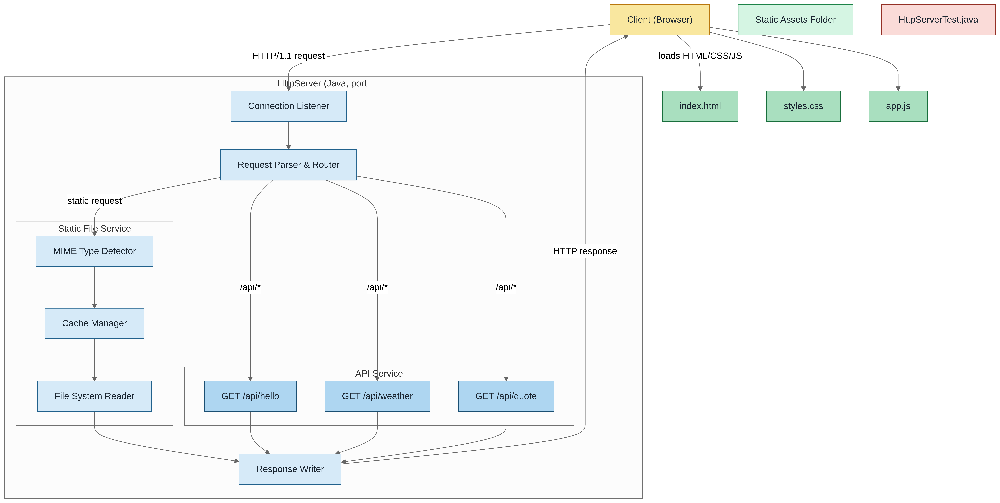

# HTTP Server - AREP Workshop 1

An HTTP web server implemented from scratch in pure Java, without external frameworks. It supports static files, REST services, and handling multiple MIME types.

## 🎯 Features

- ✅ Complete HTTP server with no external dependencies
- ✅ Support for static files (HTML, CSS, JS, images)
- ✅ REST API with mock endpoints
- ✅ In-memory file cache
- ✅ Automatic MIME type detection
- ✅ Demo web application

## 🏗️ Architecture



### Main Class

- **HttpServer** (`src/main/java/com/escuelaing/arep/HttpServer.java`): Main server that handles connections, routing, MIME types, and REST services

## 📄 Project Structure

```
Arep_Taller_1/
├── src/
│   ├── main/
│   │   ├── java/com/escuelaing/arep/
│   │   │   └── HttpServer.java          # Main server implementation
│   │   └── resources/
│   │       └── static/                  # Static web files
│   │           ├── index.html          # Main page
│   │           ├── styles.css          # Styles
│   │           ├── app.js              # Client-side logic
│   │           └── logo.svg            # Application logo
│   └── test/
│       └── java/com/escuelaing/arep/
│           └── HttpServerTest.java      # Unit tests
├── target/                              # Maven build output
├── pom.xml                             # Maven configuration
├── README.md                           # This file
├── LICENSE.md                          # MIT License
└── diagram.png                         # Architecture diagram
```

## 🚀 Quick Start

### Prerequisites

- Java 21+
- Maven 3.6+

### Installation and Running

1. **Clone and compile**:

```bash
git clone https://github.com/diegcard/Arep_Taller_1.git
cd Arep_Taller_1
mvn clean compile
```

2. **Run server**:

```bash
# Recommended option
mvn exec:java -Dexec.mainClass="com.escuelaing.arep.HttpServer"

# Alternatives
java -cp target/classes com.escuelaing.arep.HttpServer
java -cp target/urlobject-1.0-SNAPSHOT.jar com.escuelaing.arep.HttpServer
```

3. **Access the application**:

```
http://localhost:35000
```


4. ### Stopping the Server
- Press `Ctrl+C` in the terminal
- The server will log shutdown information and close gracefully

## 🌐 API and Features

### Static Files

Supports multiple File types with automatic MIME detection:

| Type | Extensions | Content-Type |
|------|-------------|--------------|
| HTML | .html, .htm | text/html |
| CSS | .css | text/css |
| JavaScript | .js | application/javascript |
| Images | .png, .jpg, .gif, .svg, .ico, .webp | image/* |
| Fonts | .woff, .woff2, .ttf, .eot | font/* |
| Documents | .pdf, .txt, .zip | application/* |

### REST Endpoints

| Endpoint | Method | Description | Example |
|----------|--------|-------------|---------|
| `/api/hello` | GET | Custom greeting | `/api/hello?name=Diego` |
| `/api/weather` | GET | Simulated Bogotá weather | JSON response with temperature |
| `/api/quote` | GET | Random inspirational quote | JSON response with quote |

### Server Configuration
| Parameter | Value | Description |
|-----------|-------|-------------|
| Port | 35000 | Server listening port |
| Static Files Directory | `src/main/resources/static` | Root directory for static files |
| Connection Type | Sequential | Handles one request at a time |


### Web Demo

The application includes a complete interface with:

- Interactive forms for testing APIs
- Asynchronous communication with JavaScript
- Responsive interface with modern CSS
- Loading state and error handling

## 🧪 Tests

```bash
mvn test
```

Results:

```bash
[INFO] -------------------------------------------------------
[INFO]  T E S T S
[INFO] -------------------------------------------------------
[INFO] Running com.escuelaing.arep.HttpServerTest
[INFO] Tests run: 10, Failures: 0, Errors: 0, Skipped: 0, Time elapsed: 0.065 s - in com.escuelaing.arep.HttpServerTest
[INFO] 
[INFO] Results:
[INFO] 
[INFO] Tests run: 10, Failures: 0, Errors: 0, Skipped: 0
[INFO] 
[INFO] ------------------------------------------------------------------------
[INFO] BUILD SUCCESS
[INFO] ------------------------------------------------------------------------
[INFO] Total time:  1.417 s
[INFO] Finished at: 2025-08-18T19:17:43-05:00
[INFO] ------------------------------------------------------------------------
```

Tests include:

- HTTP server unit tests
- MIME type validation
- REST endpoint testing
- Error and edge case handling

## 📦 Project Structure

```
src/
├── main/java/com/escuelaing/arep/
│ └── HttpServer.java # Main server
├── main/resources/static/
│ ├── index.html # Home Page
│ ├── styles.css # Styles
│ ├── app.js # Client-side Logic
│ └── logo.svg # App Logo
└── test/java/com/escuelaing/arep/
└── HttpServerTest.java # Unit Tests
```

## 🛠️ Technologies

- **Java 21**: Core Language
- **Maven**: Dependency Management and Building
- **JUnit 5**: Testing Framework
- **Vanilla JavaScript**: Framework-free Frontend
- **CSS3**: Responsive Styles

## 👨‍💻 Author

**Diego Cardenas** - [diegcard](https://github.com/diegcard)

## 📄 License

This project is licensed under the MIT License - see [LICENSE.md](LICENSE.md) for details.

---

**Julio Garavito Colombian School of Engineering**
**Enterprise Architectures (AREP) - Workshop 1**
